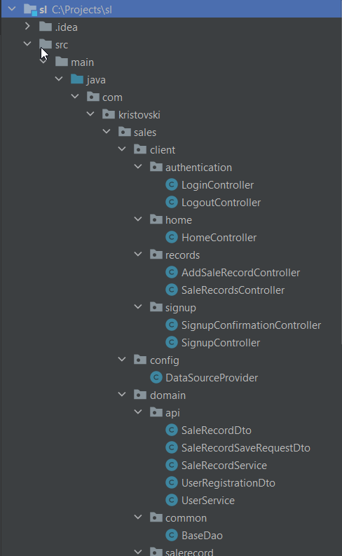
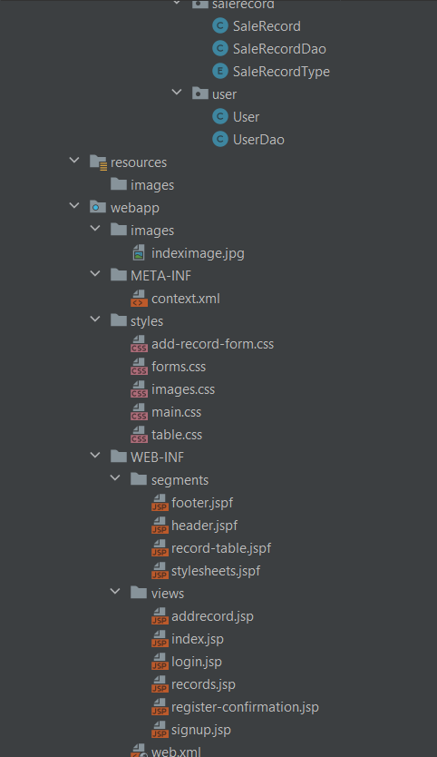
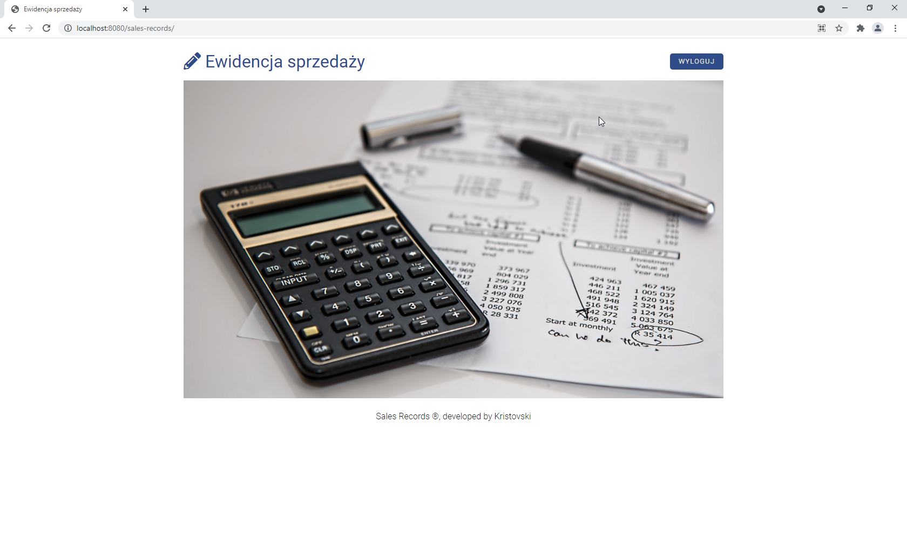
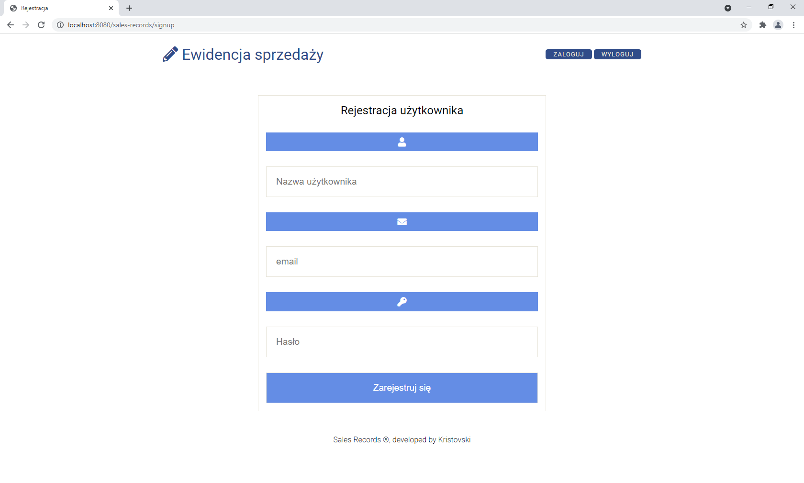
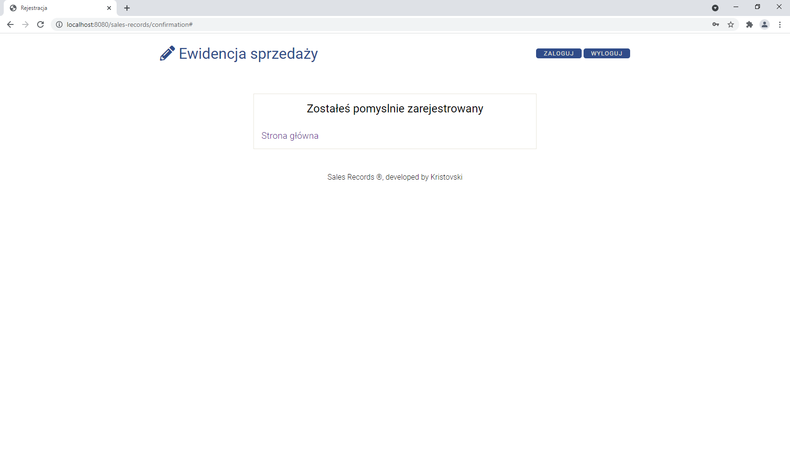
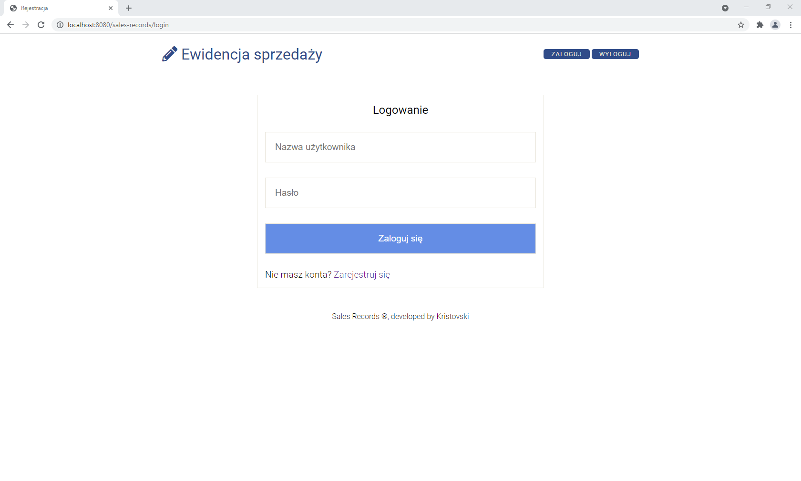
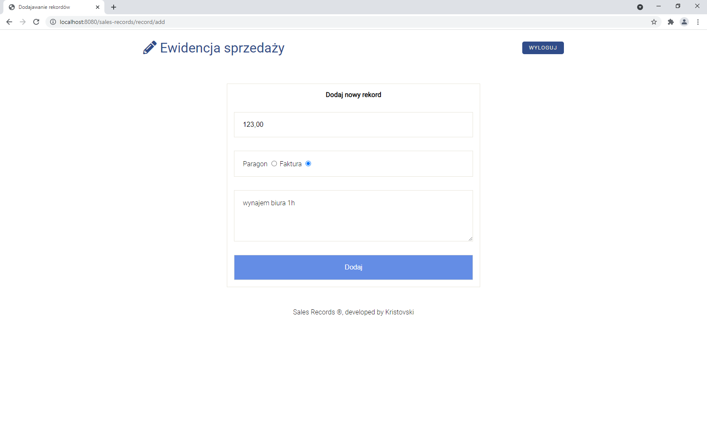
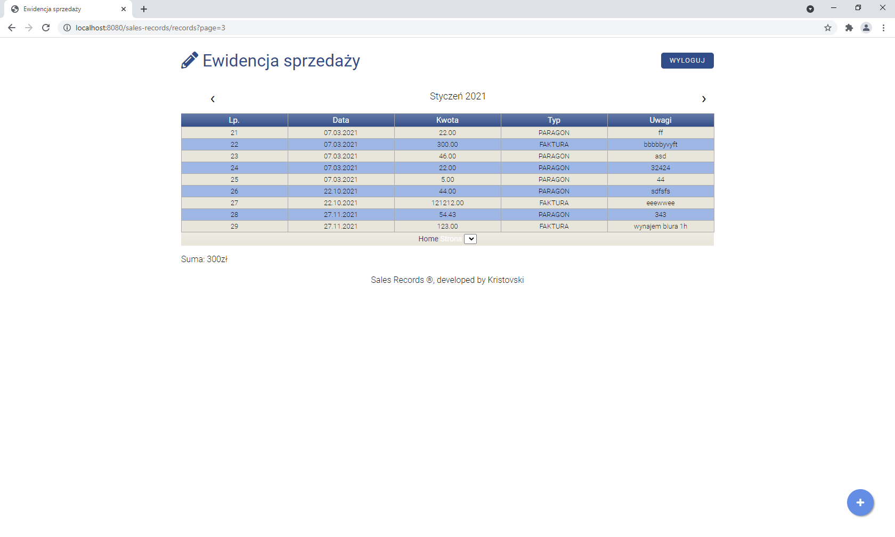

# Sales Registration App 

 
This project is based on **Servlets and JSP** (JakartaServer pages) - included in **JakartaEE**.
The reason I created this application was **to learn the foundations of web applications**.
Now I would like to focus on the Spring framework rather than legacy code so I think this application will not be further developed.

## Technologies
* Java 15
* Maven
* JakartaEE
* Tomcat 10
* Mysql
* JSP
* JSTL
* HTML
* CSS

## Functionality:
* user registration
* user login
* adding records
* pagination

## Project Structure

## Screenshots

There are still many to do:
* finish pagination 
* sorting by date/months
* exceptions handling
* tests

But as I mentioned before, I wouldn't like to focus on this technology, so I freeze the project at this stage.
 

    <b><a href="#top">↥ back to top</a></b>

 